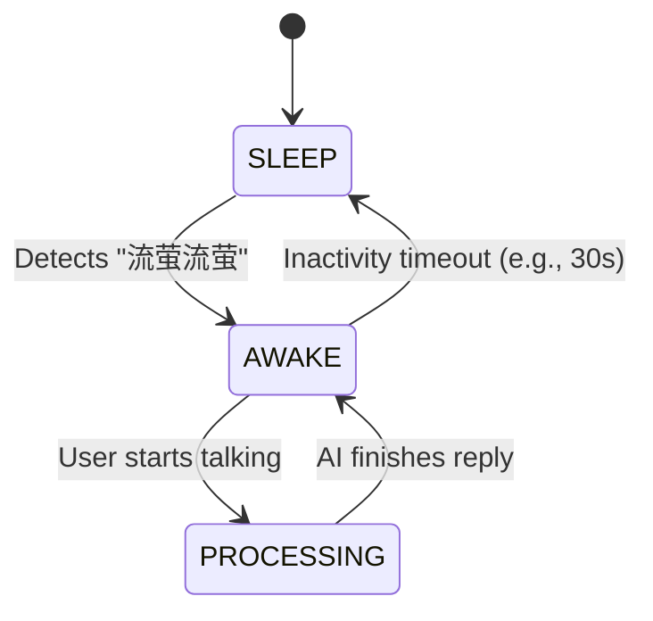

# Awake Word Detection Scheme: "流萤流萤"

To enable hands-free interaction, Firefly needs a background "awake word" detector. This document outlines the proposed implementation.

## 1. Selected Technology: PicoVoice Porcupine

### Why?
- **Efficiency**: Extremely low CPU usage (runs on single-core microcontrollers).
- **Reliability**: High accuracy even in noisy environments.
- **Customization**: Supports custom keywords like "流萤流萤".

## 2. Architectural Design: State Machine

We will implement a simple state machine to manage the agent's behavior:



## 3. Component Design

### 3.1. `WakeWordService` (New)
A background thread in the backend that:
1. Opens a dedicated microphone stream (using `PyAudio`).
2. Continuously feeds small audio chunks into the Porcupine engine.
3. On detection, emits an event (or updates a global flag).

### 3.2. Integration with [Agent](file:///E:/firefly_desktop/backend/service/agent.py#149-706)
- The [Agent](file:///E:/firefly_desktop/backend/service/agent.py#149-706) will have an `active` property. 
- When `active=False`, it ignores all voice input except the wake word.
- When `active=True`, it switches to the VAD-based STT loop.

## 4. Proposed Implementation Steps

1. **Environment Setup**:
   ```bash
   pip install pvporcupine pyaudio
   ```
2. **KeyWord Model**: Generate/Obtain the `.ppn` file for "流萤流萤" from the PicoVoice console.
3. **Service Development**: Create `backend/voice/wake_word.py`.
4. **App Integration**:
   - Start `WakeWordService` in the FastAPI [lifespan](file:///e:/firefly_desktop/backend/api/app.py#36-67).
   - Add a WebSocket/SSE event to notify the frontend when the agent is "awoken".
   - (Optional) Play a "wake-up" sound.

## 5. Security and Privacy
- Audio processed by Porcupine is done **locally**; no voice data is sent to the cloud for wake word detection.
- STT (Whisper) is only activated **after** the wake word is detected.
