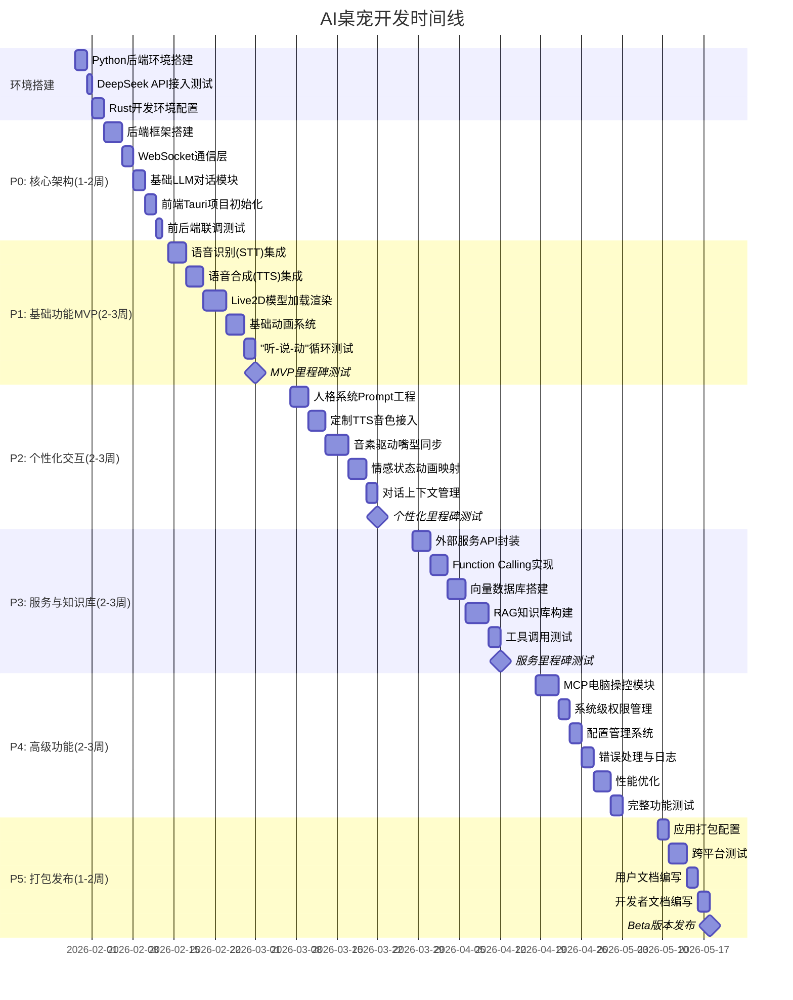

# AI桌宠 Firefly 开发文档

> **项目定位**: 对标阶跃AI、MiniMax的情感Live2D桌面AI助手  
> **核心能力**: 人格模拟、语音对话、电脑操控、工具调用、Live2D渲染  
> **后端架构**: FastAPI + LangChain + DeepSeek + FastMCP  
> **前端架构**: Windows C++ (WebView2) + React + Live2D Cubism SDK  
> **更新日期**: 2026-03-02

---

## 第一部分:项目开发时间线



---

## 第二部分:技术选型与技术细节

### 2.1 整体系统架构

**架构模式**: WebView2桌面应用 + FastAPI后端 + 实时WebSocket通信

```
┌─────────────────────────────────────────────────────────────────┐
│                    Windows本机 (firefly_frontend)               │
│                         main.cpp                                │
├─────────────────────────────────────────────────────────────────┤
│                      WebView2 容器                               │
│  ┌─────────────────────────────────────────────────────────┐   │
│  │               React渲染进程 (index.html)              │   │
│  │  ┌────────────────────────────────────────────────┐   │   │
│  │  │  主UI容器    │  Live2D Canvas   │  输入框      │   │   │
│  │  │  对话面板    │  Pixi.js渲染    │  语音按钮    │   │   │
│  │  │  设置面板    │  Live2D模型     │  发送按钮    │   │   │
│  │  └────────────────────────────────────────────────┘   │   │
│  │                                                         │   │
│  │         WebSocket (ws://localhost:8000)               │   │
│  └────────────────────┬────────────────────────────────────┘   │
└─────────────────────────┼──────────────────────────────────────┘
                          │ WebSocket
                          ▼
┌──────────────────────────────────────────────────────────────────┐
│                   Python后端 (FastAPI)                           │
│                    main.py (port 8000)                           │
├──────────────────────────────────────────────────────────────────┤
│  ┌──────────────────────────────────────────────────────────┐   │
│  │  FastAPI应用 (api/app.py)                               │   │
│  │  ┌────────────────────────────────────────────────────┐ │   │
│  │  │  /agent/chat (REST)      |  /ws/agent/chat (WS)  │ │   │
│  │  │  /chat/{provider}        |  /tools/*            │ │   │
│  │  └────────────────────────────────────────────────────┘ │   │
│  └──────────────────────────────────────────────────────────┘   │
│  ┌──────────────────────────────────────────────────────────┐   │
│  │  ChatAgent核心引擎 (service/agent.py)                   │   │
│  │  ┌────────────────────────────────────────────────────┐ │   │
│  │  │  LangChain ReAct Agent                            │ │   │
│  │  │  • 对话理解与生成                                │ │   │
│  │  │  • 工具调用循环 (Tool Calling Loop)              │ │   │
│  │  │  • 上下文记忆管理                                │ │   │
│  │  └────────────────────────────────────────────────────┘ │   │
│  └──────────────────────────────────────────────────────────┘   │
│  ┌──────────────────────────────────────────────────────────┐   │
│  │  LLM服务层 (service/)                                   │   │
│  │  ┌──────────────┐  ┌──────────────┐  ┌──────────────┐   │   │
│  │  │DeepSeek      │  │Embedding     │  │其他LLM       │   │   │
│  │  │(service/deep-│  │模型          │  │提供商        │   │   │
│  │  │seek.py)      │  │              │  │              │   │   │
│  │  └──────────────┘  └──────────────┘  └──────────────┘   │   │
│  └──────────────────────────────────────────────────────────┘   │
│  ┌──────────────────────────────────────────────────────────┐   │
│  │  语音处理层 (voice/)                                    │   │
│  │  ┌──────────────┐  ┌──────────────┐                      │   │
│  │  │STT 语音转文字│  │TTS 文字转语音│                      │   │
│  │  │(faster-      │  │(GeniTTS)     │                      │   │
│  │  │whisper)      │  │              │                      │   │
│  │  └──────────────┘  └──────────────┘                      │   │
│  └──────────────────────────────────────────────────────────┘   │
│  ┌──────────────────────────────────────────────────────────┐   │
│  │  工具层 (tools/)                                        │   │
│  │  ┌──────────────┐  ┌──────────────┐  ┌──────────────┐   │   │
│  │  │Fast MCP      │  │Local工具     │  │工具注册表    │   │   │
│  │  │(launch_app)  │  │(add, open)   │  │(registry)    │   │   │
│  │  │              │  │              │  │              │   │   │
│  │  └──────────────┘  └──────────────┘  └──────────────┘   │   │
│  └──────────────────────────────────────────────────────────┘   │
│  ┌──────────────────────────────────────────────────────────┐   │
│  │  知识库与存储 (ChromaDB、配置)                           │   │
│  │  ┌──────────────┐  ┌──────────────┐  ┌──────────────┐   │   │
│  │  │向量数据库    │  │配置文件      │  │对话历史      │   │   │
│  │  │(ChromaDB)    │  │(config.yaml) │  │(history/)    │   │   │
│  │  └──────────────┘  └──────────────┘  └──────────────┘   │   │
│  └──────────────────────────────────────────────────────────┘   │
└──────────────────────────────────────────────────────────────────┘
```

**关键通信流程**：

```
1. 用户在WebView2输入 (文本或语音)
           ↓
2. React组件发送 WebSocket/HTTP 请求到后端
           ↓
3. FastAPI接收，转发给 ChatAgent
           ↓
4. ChatAgent调用 LLM (DeepSeek) 进行推理
           ↓
5. 若LLM返回tool_calls，执行对应工具
           ↓
6. 返回AI文本响应，触发TTS合成语音
           ↓
7. 返回WebSocket消息，包管理情感TAG
           ↓
8. 前端React解析响应：
   • 显示文字内容
   • 触发Live2D动画
   • 播放合成语音
```

### 2.2 技术栈详解

#### 2.2.1 前端技术栈 (Windows C++ + WebView2 + React)

**本机应用层 (C++)**

| 技术         | 版本 | 用途              | 说明                                      |
|--------------|------|-------------------|-------------------------------------------|
| **C++**      | 17   | 核心编程语言      | Visual Studio 2019+ 编译                 |
| **WebView2** | Latest| 浏览器嵌入        | Windows原生Web容器，比Electron更轻量     |
| **WRL (Windows Runtime Library)** | - | COM编程 | WebView2 API调用 |
| **WIL (Windows Implementation Library)** | Latest | 辅助库 | COM异常处理 |

**WebView2容器中的Web前端**

| 技术              | 版本  | 用途              | 说明                                      |
|-------------------|-------|-------------------|-------------------------------------------|
| **HTML5**         | Latest| 页面结构          | 标准Web页面 (pages/chat/index.html)      |
| **React**         | 18.x  | UI框架            | 组件化前端开发                            |
| **TypeScript**    | 5.x   | 类型系统          | 类型安全的JavaScript                     |
| **Tailwind CSS**  | 3.x   | 样式框架          | 快速响应式设计                            |
| **Pixi.js**       | 8.x   | 2D渲染引擎        | WebGL高性能渲染                           |
| **live2d-cubism-web** | 5-r4 | Live2D SDK | 官方Live2D Web SDK                       |
| **WebSocket**     | 原生  | 实时通信          | 与后端双向通信                            |

**前端核心功能**  

### 2.3 核心模块说明

#### 2.3.1 后端核心文件结构

根据实际代码，后端采用以下模块化设计：

```
backend/
├── main.py                    # 并发运行FastAPI+FastMCP的入口
├── api/
│   ├── app.py                # FastAPI应用定义,含所有HTTP和WebSocket路由
│   └── __init__.py
├── service/
│   ├── agent.py              # 核心ChatAgent,实现LangChain ReAct循环+工具调用
│   ├── deepseek.py           # DeepSeek LLM服务实现(AsyncOpenAI)
│   ├── llm_service.py        # LLM服务基类和数据类定义
│   ├── llm_register.py       # LLM服务提供商注册中心
│   └── __pycache__/
├── tools/
│   ├── launch_app.py         # FastMCP本地工具实现(add, open_application等)
│   ├── registry_tools.py     # 工具注册表,管理所有可用工具
│   ├── stdio_mcp.py          # 标准IO MCP协议通信实现
│   ├── utils.py              # 工具辅助函数
│   ├── __init__.py
│   └── __pycache__/
├── voice/
│   ├── stt.py                # Faster Whisper语音识别实现
│   ├── tts_service.py        # GeniTTS语音合成实现
│   ├── convert_tts_model.py  # TTS模型转换工具
│   └── __pycache__/
├── requirements.txt          # pip依赖列表
├── pyproject.toml            # Poetry项目配置
└── README.md
```

#### 2.3.2 关键文件功能说明

| 文件 | 核心功能 | 重要方法 |
|------|---------|---------|
| `main.py` | FastAPI和FastMCP并发启动,TTS预加载 | `main()`, `run_fastapi()`, `run_fastmcp()`, `load_tts_models()` |
| `api/app.py` | API路由定义,WebSocket连接管理,生命周期管理 | `lifespan()`, `/agent/chat`, `/ws/agent/chat` |
| `service/agent.py` | ReAct Agent循环,工具调用执行,消息管理 | `process_message()`, `execute_tool_call()`, `convert_mcp_tools_to_openai_schema()` |
| `service/deepseek.py` | 与DeepSeek API通信,消息格式转换 | `chat_completion()`, `chat_completion_stream()` |
| `tools/launch_app.py` | FastMCP服务器实现,本地工具(add/open) | `add()`, `open_application()`, `mcp.run_async()` |
| `tools/registry_tools.py` | 工具管理和注册 | `get_cached_tools()`, `add_tool()` |
| `voice/stt.py` | Faster Whisper实时语音识别 | `recognize()`, `recognize_from_mic()` |
| `voice/tts_service.py` | GeniTTS文字转语音,音素提取 | `synthesize()`, `initialize_character()` |

#### 2.3.3 LangChain ReAct Agent工作流

实际代码中Agent的执行流程:

```python
# 1. 用户输入 → FastAPI接收
msg = {"content": "帮我计算15+27"}

# 2. ChatAgent.process_message() 被调用
# 核心循环:
while iteration < max_iterations:
    # 3. 调用LLM (DeepSeek)
    response = await deepseek_service.chat_completion(
        messages=messages,
        tools=tool_schema_list  # 转换后的OpenAI格式
    )
    
    # 4. 检查LLM返回
    if response.finish_reason == "tool_calls":
        # 有工具调用
        for tool_call in response.tool_calls:
            # 5. 执行工具
            result = await execute_tool_call(tool_call)
            
            # 6. 将结果作为tool消息追加
            messages.append({
                "role": "assistant",
                "tool_calls": [tool_call]
            })
            messages.append({
                "role": "tool",
                "tool_call_id": tool_call.id,
                "content": result
            })
    
    elif response.finish_reason == "stop":
        # 获得最终答案
        return response.content
```

#### 2.3.4 WebSocket通信流程

前端和后端通过WebSocket实时通信:

```
1. 前端(WebView2) 连接到 ws://localhost:8000/ws/agent/chat
   ↓
2. FastAPI的 websocket_endpoint() 接收连接
   ↓
3. 前端发送消息: {"type": "message", "content": "你好"}
   ↓
4. 后端接收并转发给 ChatAgent.process_message()
   ↓
5. Agent返回响应: {"text": "你好!", "emotion": "开心", ...}
   ↓
6. 后端通过WebSocket发送响应给前端
   ↓
7. 前端React组件:
   - 显示文字
   - 触发TTS合成语音  
   - 驱动Live2D动画
   - 播放语音
```

### 2.4 前端架构详解

#### 2.4.1 WebView2 + React集成

**main.cpp** - Windows原生入口:

```cpp
// 关键代码片段
// 1. 创建透明窗口 (支持Live2D叠加)
CreateWindowEx(
    WS_EX_LAYERED | WS_EX_TRANSPARENT | WS_EX_TOPMOST,
    L"FireflyDesktop", L"Firefly", WS_POPUP,
    ...
)

// 2. 初始化WebView2
CreateCoreWebView2EnvironmentWithOptions(...)

// 3. 加载网页
webview->Navigate(L"E:/firefly_desktop/frontend/index.html")
```

**pages/chat/index.html** - React应用入口:

- 使用Tailwind CSS进行样式
- 集成Live2D Cubism SDK
- WebSocket客户端实现
- 丰富的UI组件

**特色功能**:
- 拖动窗口功能
- 设置面板
- 实时状态指示
- TTS控制开关
- 语音输入按钮

#### 2.4.2 Live2D集成关键点

```html
<!-- Canvas用于Live2D渲染 -->
<canvas id="live2d-canvas"></canvas>

<!-- 使用Pixi.js + Live2D Cubism SDK -->
<script src="CubismSdkForWeb-5-r.4/Core/live2dcubismcore.min.js"></script>
<script src="assets/js/pixi.min.js"></script>
<script src="assets/js/cubism4.min.js"></script>
<script src="assets/js/model.js"></script>
```

关键组件:
- **Model管理**: 加载.model3.json模型
- **动画播放**: PlayMotion, SetExpression
- **参数控制**: 嘴型(Mouth), 眼睛(Eyes)等
- **事件处理**: 点击、拖动响应

#### 2.4.3 实时通信实现

```javascript
// WebSocket客户端
const ws = new WebSocket('ws://localhost:8000/ws/agent/chat');

ws.onmessage = async (event) => {
    const response = JSON.parse(event.data);
    
    // 显示文字
    displayMessage(response.text);
    
    // 触发TTS
    if (response.audio) {
        playAudio(response.audio);
    }
    
    // 触发Live2D动画
    if (response.emotion) {
        playAnimation(response.emotion);
    }
};

// 发送消息
function sendMessage(text) {
    ws.send(JSON.stringify({
        type: "message",
        content: text
    }));
}
```

---

## 第三部分:开发规划

### 当前状态 (2026-03-02)

**已完成**:
- ✅ FastAPI后端框架搭建
- ✅ Faster Whisper STT集成
- ✅ GeniTTS TTS集成  
- ✅ LangChain ReAct Agent实现
- ✅ FastMCP工具框架
- ✅ DeepSeek API集成
- ✅ WebView2 + React前端
- ✅ Live2D Cubism SDK集成
- ✅ WebSocket实时通信

**进行中**:
- 🔄 Live2D口型同步算法优化
- 🔄 情感识别和动画映射
- 🔄 对话历史管理完善
- 🔄 用户信息持久化

**计划中**:
- ⏳ ChromaDB向量数据库集成
- ⏳ RAG知识库功能
- ⏳ MCP电脑操控扩展
- ⏳ 配置管理系统
- ⏳ 应用打包和发布

### 下一步任务优先级

1. **高优先级** - 用户体验
   - [ ] 优化STT/TTS延迟
   - [ ] 完善口型同步精度
   - [ ] 增强情感表达动画
   - [ ] 改进UI美观度

2. **中优先级** - 功能扩展
   - [ ] ChromaDB集成
   - [ ] RAG知识库
   - [ ] 对话导出功能
   - [ ] 个性化设置保存

3. **低优先级** - 高级特性
   - [ ] 离线语言模型
   - [ ] 本地推理加速
   - [ ] 社区插件系统
   - [ ] 多角色支持

---

## 第三部分:详细开发计划

### P0: 核心架构搭建 (预计10天)

#### 后端框架搭建

- [x] **环境准备**
    - [x] 安装Python 3.11+
    - [x] 配置Poetry依赖管理
    - [x] 安装基础依赖包
    ```bash
    poetry add fastapi uvicorn websockets pydantic
    poetry add langchain langchain-openai langchain-community
    poetry add llama-index llama-index-vector-stores-chroma
    poetry add chromadb sentence-transformers
    poetry add fastmcp
    ```

- [x] **项目结构设计**
    ```
    ai-desktop-pet-backend/
    ├── src/
    │   ├── core/
    │   │   ├── config.py          # 配置管理
    │   │   ├── logger.py          # 日志系统
    │   │   └── exceptions.py      # 自定义异常
    │   ├── agents/
    │   │   ├── dialog_agent.py    # LangChain对话Agent
    │   │   ├── tools.py           # LangChain工具定义
    │   │   └── prompts.py         # Prompt模板
    │   ├── knowledge/
    │   │   ├── index.py           # LlamaIndex索引
    │   │   ├── retriever.py       # 检索器
    │   │   └── embeddings.py      # 嵌入模型
    │   ├── mcp/
    │   │   ├── computer_control.py # 电脑操控MCP
    │   │   ├── file_system.py     # 文件系统MCP
    │   │   └── browser.py         # 浏览器MCP
    │   ├── voice/
    │   │   ├── stt.py             # 语音识别
    │   │   └── tts.py             # 语音合成
    │   ├── api/
    │   │   ├── websocket.py       # WebSocket路由
    │   │   └── http.py            # HTTP API
    │   └── main.py                # 应用入口
    ├── tests/                     # 测试文件
    ├── knowledge_docs/            # 知识库文档
    ├── chroma_db/                 # 向量数据库
    ├── pyproject.toml
    └── README.md
    ```

- [ ] **配置管理实现**
    ```python
    from pydantic_settings import BaseSettings
    
    class Settings(BaseSettings):
        # API配置
        deepseek_api_key: str
        deepseek_base_url: str = "https://api.deepseek.com/v1"
        
        # 服务配置
        host: str = "0.0.0.0"
        port: int = 8000
        
        # Agent配置
        agent_temperature: float = 0.8
        agent_max_tokens: int = 2048
        
        # 知识库配置
        chroma_persist_dir: str = "./chroma_db"
        embedding_model: str = "BAAI/bge-large-zh-v1.5"
        
        # 语音配置
        whisper_model: str = "whisper-1"
        tts_voice: str = "zh-CN-XiaoxiaoNeural"
        
        class Config:
            env_file = ".env"
    ```

#### WebSocket通信层

- [ ] **WebSocket服务实现**
    - [ ] 实现连接管理器
    - [ ] 实现消息路由
    - [ ] 实现心跳机制
    - [ ] 实现错误处理

- [ ] **消息协议实现**
    ```python
    from pydantic import BaseModel
    from typing import Any, Dict, Literal
    from datetime import datetime
    
    class WSMessage(BaseModel):
        type: Literal[
            "user_input", "voice_input", "ai_response",
            "voice_output", "animation", "tool_calling",
            "error", "heartbeat"
        ]
        id: str
        timestamp: int
        data: Dict[str, Any]
    ```

#### 基础LLM对话模块

- [ ] **LangChain Agent实现**
    - [ ] 创建DialogAgent类
    - [ ] 实现ReAct推理循环
    - [ ] 集成ConversationMemory
    - [ ] 实现工具注册机制

- [x] **人格Prompt工程**
    - [ ] 设计人格模板
    - [ ] 实现动态Prompt注入
    - [ ] 测试不同人格效果

- [ ] **基础测试**
    - [ ] 测试简单对话
    - [ ] 测试上下文记忆
    - [ ] 测试多轮对话

#### 前端Tauri项目初始化

- [ ] **Tauri项目创建**
    ```bash
    npm create tauri-app@latest
    cd ai-desktop-pet
    npm install
    ```

- [ ] **React + TypeScript配置**
    - [ ] 安装依赖包
    - [ ] 配置Vite
    - [ ] 配置TailwindCSS
    - [ ] 配置Zustand

- [ ] **WebSocket客户端**
    - [ ] 实现连接逻辑
    - [ ] 实现消息发送/接收
    - [ ] 实现自动重连

#### 前后端联调测试

- [ ] **集成测试**
    - [ ] 测试WebSocket连接
    - [ ] 测试消息收发
    - [ ] 测试对话流程

**P0里程碑验收标准**:
- ✅ 后端服务能够正常启动
- ✅ 前后端WebSocket通信正常
- ✅ 基础对话功能可用
- ✅ 对话有基本的人格特征

---

### P1: 基础功能MVP (预计15天)

#### 语音识别(STT)集成

- [ ] **Whisper API集成**
    ```python
    from openai import OpenAI
    
    class WhisperSTT:
        def __init__(self, api_key: str):
            self.client = OpenAI(api_key=api_key)
        
        async def transcribe(self, audio_data: bytes) -> str:
            """语音转文字"""
            response = await self.client.audio.transcriptions.create(
                model="whisper-1",
                file=audio_data,
                language="zh"
            )
            return response.text
    ```

- [ ] **音频处理**
    - [ ] 实现音频格式转换
    - [ ] 实现音频降噪(可选)
    - [ ] 实现VAD(语音活动检测)

- [ ] **流式识别(可选)**
    - [ ] 实现实时音频流
    - [ ] 实现增量识别

#### 语音合成(TTS)集成

- [ ] **Azure TTS集成**
    ```python
    import azure.cognitiveservices.speech as speechsdk
    
    class AzureTTS:
        def __init__(self, subscription_key: str, region: str):
            self.speech_config = speechsdk.SpeechConfig(
                subscription=subscription_key,
                region=region
            )
            self.speech_config.speech_synthesis_voice_name = "zh-CN-XiaoxiaoNeural"
        
        async def synthesize(self, text: str) -> tuple[bytes, list]:
            """文字转语音,返回音频和音素"""
            synthesizer = speechsdk.SpeechSynthesizer(
                speech_config=self.speech_config,
                audio_config=None
            )
            
            result = synthesizer.speak_text_async(text).get()
            
            # 提取音频
            audio_data = result.audio_data
            
            # 提取音素(需要SSML)
            phonemes = self._extract_phonemes(result)
            
            return audio_data, phonemes
    ```

- [ ] **音素数据提取**
    - [ ] 解析SSML音素标记
    - [ ] 转换为时间轴数据
    - [ ] 映射到嘴型动画

- [ ] **Edge-TTS备用方案**
    - [ ] 集成Edge-TTS
    - [ ] 实现降级策略

#### Live2D模型加载渲染

- [ ] **Live2D SDK集成**
    - [ ] 引入Cubism SDK for Web
    - [ ] 配置Pixi.js渲染器
    - [ ] 实现模型加载器

- [ ] **模型资源准备**
    - [ ] 准备.model3.json文件
    - [ ] 准备纹理贴图
    - [ ] 准备动作文件(.motion3.json)
    - [ ] 准备表情文件(.exp3.json)

- [ ] **渲染优化**
    - [ ] 实现帧率控制
    - [ ] 实现LOD(细节层次)
    - [ ] 优化渲染性能

#### 基础动画系统

- [ ] **动画管理器**
    ```typescript
    class AnimationManager {
        private model: Live2DModel;
        private currentMotion: string = "idle";
        
        playMotion(motionGroup: string, index: number) {
            // 播放动作
        }
        
        setExpression(expressionName: string) {
            // 设置表情
        }
        
        updateLipSync(phoneme: string, value: number) {
            // 更新嘴型
        }
    }
    ```

- [ ] **基础动画实现**
    - [ ] idle(待机)动画
    - [ ] talk(说话)动画
    - [ ] happy(开心)动画
    - [ ] sad(伤心)动画

- [ ] **物理效果**
    - [ ] 头发摆动
    - [ ] 衣服飘动
    - [ ] 呼吸效果

#### "听-说-动"循环测试

- [ ] **集成测试场景**
    - [ ] 用户说话 → STT → Agent → TTS → 播放
    - [ ] 测试嘴型同步
    - [ ] 测试情感动画切换

- [ ] **性能优化**
    - [ ] 优化延迟
    - [ ] 优化资源占用
    - [ ] 优化渲染性能

**P1里程碑验收标准**:
- ✅ 语音对话流程完整可用
- ✅ Live2D角色能正常显示和动画
- ✅ 嘴型能基本同步语音
- ✅ 整体响应延迟<3秒

---

### P2: 个性化交互 (预计15天)

#### 人格系统Prompt工程

- [ ] **人格配置系统**
    ```python
    @dataclass
    class PersonaConfig:
        character_name: str
        character_traits: str
        core_traits: str
        tone: str
        speaking_habits: str
        common_expressions: List[str]
        background_story: str
    ```

- [ ] **多人格支持**
    - [ ] 实现人格切换
    - [ ] 实现人格配置管理
    - [ ] 提供预设人格模板

- [ ] **情感状态机**
    - [ ] 定义情感状态
    - [ ] 实现状态转换逻辑
    - [ ] 基于对话内容动态调整

#### 定制TTS音色接入

- [ ] **Azure自定义音色**
    - [ ] 配置多个音色
    - [ ] 实现音色切换
    - [ ] 调整语速、音调

- [ ] **情感化语音**
    - [ ] 根据情绪调整语气
    - [ ] 添加SSML标记
    - [ ] 优化自然度

#### 音素驱动嘴型同步

- [ ] **音素映射表**
    ```typescript
    const PHONEME_TO_MOUTH_MAP = {
        'a': 'mouth_a',
        'i': 'mouth_i',
        'u': 'mouth_u',
        'e': 'mouth_e',
        'o': 'mouth_o',
        // ...
    };
    ```

- [ ] **实时同步算法**
    - [ ] 解析音素时间轴
    - [ ] 插值平滑过渡
    - [ ] 处理音频延迟

- [ ] **优化嘴型效果**
    - [ ] 添加张嘴程度控制
    - [ ] 添加舌头动画(可选)
    - [ ] 调整同步精度

#### 情感状态动画映射

- [ ] **情感识别增强**
    ```python
    class EmotionAnalyzer:
        def analyze(self, text: str, context: dict) -> Emotion:
            # 基于文本内容
            # 基于对话历史
            # 基于用户情绪
            pass
    ```

- [ ] **动画映射规则**
    - [ ] neutral → idle动画
    - [ ] happy → smile + 身体摇摆
    - [ ] sad → frown + 低头
    - [ ] excited → jump + 挥手
    - [ ] thinking → 摸下巴

- [ ] **平滑过渡**
    - [ ] 实现动画混合
    - [ ] 优化切换效果

#### 对话上下文管理

- [ ] **LangChain Memory优化**
    - [ ] 使用ConversationSummaryMemory
    - [ ] 实现长期记忆(可选)
    - [ ] 实现对话摘要

- [ ] **上下文窗口管理**
    - [ ] 动态调整窗口大小
    - [ ] 重要信息保留策略
    - [ ] 过期信息清理

**P2里程碑验收标准**:
- ✅ 人格鲜明,对话有个性
- ✅ 嘴型同步流畅自然
- ✅ 情感表达准确生动
- ✅ 能记住对话上下文

---

### P3: 服务与知识库 (预计15天)

#### 外部服务API封装

- [ ] **LangChain工具封装**
    ```python
    class WeatherTool(BaseTool):
        name = "get_weather"
        description = "获取指定城市的天气信息"
        
        def _run(self, city: str) -> str:
            # 调用天气API
            pass
    
    class SearchTool(BaseTool):
        name = "web_search"
        description = "搜索网络信息"
        
        def _run(self, query: str) -> str:
            # 调用搜索API
            pass
    ```

- [ ] **常用服务集成**
    - [ ] 天气查询
    - [ ] 新闻搜索
    - [ ] 翻译服务
    - [ ] 日历管理(可选)

#### Function Calling实现

- [ ] **Tool Schema定义**
    - [ ] 使用Pydantic定义参数
    - [ ] 添加详细描述
    - [ ] 提供使用示例

- [ ] **工具路由器**
    ```python
    class ToolRouter:
        def __init__(self):
            self.tools: Dict[str, BaseTool] = {}
        
        def register(self, tool: BaseTool):
            self.tools[tool.name] = tool
        
        async def execute(self, tool_name: str, args: dict):
            tool = self.tools.get(tool_name)
            if not tool:
                raise ValueError(f"Tool {tool_name} not found")
            return await tool.arun(**args)
    ```

- [ ] **错误处理**
    - [ ] 工具调用失败重试
    - [ ] 参数验证
    - [ ] 超时控制

#### 向量数据库搭建

- [ ] **ChromaDB配置**
    - [ ] 设置持久化路径
    - [ ] 配置集合(Collection)
    - [ ] 配置元数据字段

- [ ] **嵌入模型优化**
    - [ ] 使用bge-large-zh-v1.5
    - [ ] 配置批量处理
    - [ ] 缓存嵌入结果

- [ ] **性能优化**
    - [ ] 索引优化
    - [ ] 查询优化
    - [ ] 内存管理

#### RAG知识库构建

- [ ] **文档处理**
    ```python
    from llama_index.core import SimpleDirectoryReader
    from llama_index.core.node_parser import SentenceSplitter
    
    # 读取文档
    documents = SimpleDirectoryReader("./docs").load_data()
    
    # 分割文档
    parser = SentenceSplitter(
        chunk_size=512,
        chunk_overlap=50
    )
    nodes = parser.get_nodes_from_documents(documents)
    ```

- [ ] **索引构建**
    - [ ] 创建VectorStoreIndex
    - [ ] 配置存储后端
    - [ ] 支持增量更新

- [ ] **查询引擎**
    - [ ] 配置检索器
    - [ ] 配置响应合成器
    - [ ] 实现混合检索(可选)

- [ ] **知识库管理**
    - [ ] 添加文档接口
    - [ ] 删除文档接口
    - [ ] 更新文档接口
    - [ ] 搜索文档接口

#### 工具调用测试

- [ ] **单元测试**
    - [ ] 测试每个工具独立功能
    - [ ] 测试参数验证
    - [ ] 测试错误处理

- [ ] **集成测试**
    - [ ] 测试Agent调用工具
    - [ ] 测试多工具组合
    - [ ] 测试知识库检索

**P3里程碑验收标准**:
- ✅ Agent能正确调用外部服务
- ✅ 知识库检索准确有效
- ✅ 工具调用成功率>90%
- ✅ 回答质量显著提升

---

### P4: 高级功能 (预计15天)

#### MCP电脑操控模块

- [ ] **FastMCP服务器开发**
    - [ ] 实现ComputerControlMCP
    - [ ] 实现FileSystemMCP
    - [ ] 实现BrowserMCP

- [ ] **安全机制**
    ```python
    class SecurityManager:
        def __init__(self):
            self.dangerous_commands = [...]
            self.require_confirmation = [...]
        
        def check_command(self, command: str) -> SecurityLevel:
            # 检查命令安全性
            pass
        
        async def request_permission(self, action: str) -> bool:
            # 请求用户授权
            pass
    ```

- [ ] **工具实现**
    - [ ] 鼠标控制
    - [ ] 键盘输入
    - [ ] 文件操作
    - [ ] 程序启动
    - [ ] 屏幕截图
    - [ ] 浏览器控制

- [ ] **权限管理**
    - [ ] 实现白名单机制
    - [ ] 敏感操作需确认
    - [ ] 操作审计日志

#### 系统级权限管理

- [ ] **权限系统设计**
    ```python
    class Permission(Enum):
        READ_FILE = "read_file"
        WRITE_FILE = "write_file"
        EXECUTE_COMMAND = "execute_command"
        CONTROL_MOUSE = "control_mouse"
        CONTROL_KEYBOARD = "control_keyboard"
    
    class PermissionManager:
        def check_permission(self, action: str) -> bool:
            pass
        
        def request_permission(self, action: str) -> bool:
            pass
    ```

- [ ] **用户授权流程**
    - [ ] 首次授权提示
    - [ ] 记住授权选择
    - [ ] 撤销授权功能

#### 配置管理系统

- [ ] **配置文件设计**
    ```yaml
    # config.yaml
    persona:
      name: "小爱"
      traits: "活泼可爱"
      voice: "zh-CN-XiaoxiaoNeural"
    
    llm:
      model: "deepseek-chat"
      temperature: 0.8
      max_tokens: 2048
    
    knowledge:
      docs_path: "./knowledge_docs"
      chunk_size: 512
    
    permissions:
      auto_approve:
        - "get_weather"
        - "web_search"
      require_confirm:
        - "click_mouse"
        - "type_text"
    ```

- [ ] **配置管理器**
    - [ ] 读取配置
    - [ ] 更新配置
    - [ ] 验证配置
    - [ ] 热重载(可选)

#### 错误处理与日志

- [ ] **异常处理体系**
    ```python
    class AIDesktopPetError(Exception):
        """基础异常类"""
        pass
    
    class LLMError(AIDesktopPetError):
        """LLM相关错误"""
        pass
    
    class ToolError(AIDesktopPetError):
        """工具调用错误"""
        pass
    ```

- [ ] **日志系统**
    ```python
    import logging
    from logging.handlers import RotatingFileHandler
    
    logger = logging.getLogger("ai_desktop_pet")
    logger.setLevel(logging.INFO)
    
    handler = RotatingFileHandler(
        "app.log",
        maxBytes=10*1024*1024,  # 10MB
        backupCount=5
    )
    logger.addHandler(handler)
    ```

- [ ] **监控与告警**
    - [ ] 性能监控
    - [ ] 错误率监控
    - [ ] 资源占用监控

#### 性能优化

- [ ] **后端优化**
    - [ ] 异步处理优化
    - [ ] 数据库查询优化
    - [ ] 缓存机制
    - [ ] 连接池管理

- [ ] **前端优化**
    - [ ] 渲染性能优化
    - [ ] 资源加载优化
    - [ ] 内存泄漏检查

- [ ] **网络优化**
    - [ ] WebSocket心跳优化
    - [ ] 消息压缩
    - [ ] 断线重连优化

#### 完整功能测试

- [ ] **集成测试**
    - [ ] 测试所有功能模块的集成
    - [ ] 测试长时间运行稳定性(24小时)
    - [ ] 测试边界情况

- [ ] **压力测试**
    - [ ] 测试高并发请求处理
    - [ ] 测试大文件处理能力
    - [ ] 测试内存占用上限

- [ ] **兼容性测试**
    - [ ] 测试Windows 10/11
    - [ ] 测试macOS Monterey+
    - [ ] 测试Linux (Ubuntu 22.04+)

**P4里程碑验收标准**:
- ✅ MCP可安全操控电脑基本功能
- ✅ 所有敏感操作需要用户确认
- ✅ 配置系统完善且易用
- ✅ 应用稳定性达到生产级别

---

### P5: 打包发布 (预计10天)

#### 应用打包配置

- [ ] **Tauri打包配置**
    ```json
    // tauri.conf.json
    {
      "package": {
        "productName": "AI桌宠",
        "version": "0.1.0"
      },
      "tauri": {
        "bundle": {
          "active": true,
          "targets": "all",
          "identifier": "com.aidesktoppet.app",
          "icon": [
            "icons/32x32.png",
            "icons/128x128.png",
            "icons/256x256.png"
          ]
        }
      }
    }
    ```

- [ ] **Python后端打包**
    ```bash
    # 使用PyInstaller
    pyinstaller --onefile \
                --add-data "knowledge_docs:knowledge_docs" \
                --add-data "chroma_db:chroma_db" \
                src/main.py
    ```

- [ ] **资源文件处理**
    - [ ] 整理Live2D模型文件
    - [ ] 压缩静态资源
    - [ ] 配置资源路径

#### 跨平台测试

- [ ] **Windows测试**
    - [ ] 测试Windows 10/11
    - [ ] 测试不同分辨率和DPI
    - [ ] 测试安装/卸载流程

- [ ] **macOS测试**
    - [ ] 测试Intel芯片Mac
    - [ ] 测试Apple Silicon (M1/M2)
    - [ ] 验证应用签名

- [ ] **Linux测试**
    - [ ] 测试Ubuntu 22.04+
    - [ ] 测试不同桌面环境

#### 用户文档编写

- [ ] **用户手册**
    - [ ] 安装指南
    - [ ] 快速入门教程
    - [ ] 功能使用说明
    - [ ] FAQ

- [ ] **视频教程**
    - [ ] 录制安装演示
    - [ ] 录制功能演示

#### 开发者文档编写

- [ ] **架构文档**
    - [ ] 更新架构设计文档
    - [ ] 绘制系统架构图

- [ ] **API文档**
    - [ ] 完善后端API文档
    - [ ] 完善WebSocket协议文档

- [ ] **二次开发指南**
    - [ ] 编写开发环境搭建指南
    - [ ] 提供插件开发示例

#### Beta版本发布

- [ ] **发布准备**
    - [ ] 代码审查和清理
    - [ ] 最终测试
    - [ ] 准备发布说明

- [ ] **发布渠道**
    - [ ] 创建GitHub Release
    - [ ] 上传安装包

**P5里程碑验收标准**:
- ✅ 各平台安装包可用
- ✅ 用户文档完整
- ✅ Beta版本发布成功

---

## 第四部分:开发日志

### 日志记录模板

| 日期       | 文档链接          | 概述                                      |
| ---------- | ----------------- | ----------------------------------------- |
| 2026-02-04 | [[日志-20260204]] | LangChain + LlamaIndex + FastMCP架构设计完成 |
| ...        | ...               | ...                                       |

---

## 附录:开发最佳实践

### 代码规范

#### Python代码规范
- 遵循PEP 8
- 使用Black进行自动格式化
- 使用Ruff进行代码检查
- 类型注解覆盖率>80%
- 文档字符串使用Google风格

#### TypeScript代码规范
- 遵循Airbnb JavaScript/TypeScript规范
- 使用Prettier进行自动格式化
- 使用ESLint进行代码检查
- 严格模式下的类型检查

### Git工作流

#### 分支策略
- `main`: 主分支,保持稳定
- `develop`: 开发分支
- `feature/*`: 功能分支
- `bugfix/*`: 修复分支

#### Commit信息格式
```
<type>(<scope>): <subject>

<body>
```

**Type类型**:
- `feat`: 新功能
- `fix`: 修复bug
- `docs`: 文档更新
- `refactor`: 重构
- `test`: 测试
- `chore`: 构建/工具变动

### 性能基准

| 指标               | 目标值  |
| ------------------ | ------- |
| 冷启动时间         | <5秒    |
| 对话响应延迟       | <2秒    |
| STT识别延迟        | <1秒    |
| TTS生成延迟        | <1秒    |
| Live2D帧率         | ≥60 FPS |
| 内存占用(空闲)     | <500MB  |
| 内存占用(对话中)   | <800MB  |

### 安全考虑

- API Key使用环境变量
- 敏感操作需要用户确认
- 限制文件访问路径
- 限制可执行命令
- 实现操作审计日志
- 定期更新依赖

---

## 结语

本开发文档基于**LangChain + LlamaIndex + FastMCP**的技术栈,提供了完整的AI桌宠开发方案。

**核心技术优势**:
1. **LangChain**: 强大的Agent编排能力,丰富的工具生态
2. **LlamaIndex**: 专业的RAG框架,高效的知识检索
3. **FastMCP**: 轻量级的电脑操控协议实现

**项目原则**:
1. 模块化设计,易于扩展
2. 类型安全,代码质量高
3. 用户体验优先
4. 安全性考虑周全

**联系方式**:
- GitHub: [项目仓库链接]
- Email: [联系邮箱]

---

**文档版本**: v2.0  
**创建日期**: 2026-01-28  
**最后更新**: 2026-02-04  
**后端架构**: LangChain + LlamaIndex + FastMCP  
**作者**: AI桌宠项目组
