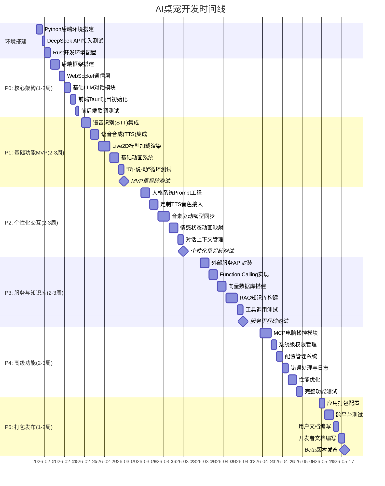

# AI桌宠项目开发文档

> **项目定位**: 对标MiniMax、阶跃AI等桌面AI助手的情感Live2D桌面通用AI桌宠  
> **核心能力**: 人格模拟、语音对话、电脑操控、工具调用、Live2D渲染  
> **后端架构**: LangChain + LlamaIndex + FastMCP

---

## 第一部分:项目甘特图



---

## 第二部分:技术选型与技术细节

### 2.1 整体架构设计

**架构模式**: 前后端分离 + WebSocket实时通信 + Agent编排

```
┌─────────────────────────────────────────────────────┐
│                   前端 (Tauri)                       │
│  ┌─────────────┐  ┌──────────────┐  ┌────────────┐ │
│  │   React UI  │  │ Live2D渲染层 │  │ WebSocket  │ │
│  │   组件层    │  │  (Canvas)    │  │   客户端    │ │
│  └─────────────┘  └──────────────┘  └────────────┘ │
│         │                │                  │        │
│         └────────────────┴──────────────────┘        │
│                          │                            │
│                  Tauri Rust Core                      │
│                 (系统调用、窗口管理)                    │
└──────────────────────────┬──────────────────────────┘
                           │ WebSocket
                           │
┌──────────────────────────┴──────────────────────────┐
│              Python后端 (FastAPI)                    │
│  ┌─────────────────────────────────────────────┐   │
│  │         Agent编排层 (LangChain)              │   │
│  │  ┌──────────┐ ┌────────────┐ ┌───────────┐ │   │
│  │  │ReAct Agent│ │ Tool Router│ │ Memory    │ │   │
│  │  │对话引擎   │ │  工具路由  │ │ 上下文管理│ │   │
│  │  └──────────┘ └────────────┘ └───────────┘ │   │
│  └─────────────────────────────────────────────┘   │
│  ┌─────────────────────────────────────────────┐   │
│  │       知识库层 (LlamaIndex)                  │   │
│  │  ┌──────────┐ ┌────────────┐ ┌───────────┐ │   │
│  │  │文档索引  │ │ Query Engine│ │ Retriever │ │   │
│  │  │ RAG管道  │ │  查询引擎  │ │ 检索器    │ │   │
│  │  └──────────┘ └────────────┘ └───────────┘ │   │
│  └─────────────────────────────────────────────┘   │
│  ┌─────────────────────────────────────────────┐   │
│  │         工具层 (FastMCP)                      │   │
│  │  ┌──────────┐ ┌────────────┐ ┌───────────┐ │   │
│  │  │电脑操控  │ │ 文件系统   │ │ 浏览器控制│ │   │
│  │  │MCP Server│ │  MCP Server│ │MCP Server │ │   │
│  │  └──────────┘ └────────────┘ └───────────┘ │   │
│  └─────────────────────────────────────────────┘   │
│  ┌─────────────────────────────────────────────┐   │
│  │           数据层                              │   │
│  │  ┌─────────┐ ┌──────────┐ ┌──────────────┐ │   │
│  │  │向量数据库│ │配置管理  │ │  状态管理    │ │   │
│  │  │(Chroma) │ │(Pydantic)│ │ (Redis可选)  │ │   │
│  │  └─────────┘ └──────────┘ └──────────────┘ │   │
│  └─────────────────────────────────────────────┘   │
│  ┌─────────────────────────────────────────────┐   │
│  │          外部服务层                           │   │
│  │  ┌─────────┐ ┌──────────┐ ┌──────────────┐ │   │
│  │  │DeepSeek │ │ Whisper  │ │  Azure TTS   │ │   │
│  │  │   LLM   │ │   STT    │ │    语音合成  │ │   │
│  │  └─────────┘ └──────────┘ └──────────────┘ │   │
│  └─────────────────────────────────────────────┘   │
└────────────────────────────────────────────────────┘
```

### 2.2 技术栈详解

#### 2.2.1 前端技术栈 (Tauri + React)

| 技术                  | 版本  | 用途         | 选型理由                         |
| --------------------- | ----- | ------------ | -------------------------------- |
| **Tauri**             | 2.x   | 桌面应用框架 | 轻量级、安全、跨平台、性能优异   |
| **Rust**              | 1.75+ | 系统层开发   | 高性能、内存安全、系统调用能力强 |
| **React**             | 18.x  | UI层框架     | 生态丰富、组件化、易于开发       |
| **TypeScript**        | 5.x   | 类型系统     | 提高代码质量和可维护性           |
| **Vite**              | 5.x   | 构建工具     | 快速的开发体验                   |
| **Pixi.js/WebGL**     | 7.x   | Live2D渲染   | 高性能2D渲染引擎                 |
| **live2d-cubism-web** | 4.x   | Live2D SDK   | 官方Web SDK支持                  |
| **Zustand**           | 4.x   | 状态管理     | 轻量级、易用的React状态管理      |
| **TailwindCSS**       | 3.x   | 样式框架     | 快速UI开发                       |

#### 2.2.2 后端技术栈 (Python)

**核心框架**

| 技术           | 版本   | 用途       | 选型理由                   |
| -------------- | ------ | ---------- | -------------------------- |
| **Python**     | 3.11+  | 后端语言   | AI生态丰富、开发效率高     |
| **FastAPI**    | 0.109+ | Web框架    | 高性能、异步支持、自动文档 |
| **Uvicorn**    | 0.27+  | ASGI服务器 | 高性能异步服务器           |
| **Pydantic**   | 2.x    | 数据验证   | 类型安全、配置管理         |
| **WebSockets** | 12.x   | 实时通信   | 双向通信、低延迟           |

**AI & Agent编排层**

| 技术              | 版本  | 用途           | 选型理由                                     |
| ----------------- | ----- | -------------- | -------------------------------------------- |
| **LangChain**     | 0.3.x | Agent编排框架  | 完整的Agent生态、丰富的工具链、ReAct支持     |
| **LangGraph**     | 0.2.x | 工作流编排     | 状态机式Agent流程控制、可视化调试            |
| **LlamaIndex**    | 0.11.x| RAG框架        | 专业的文档索引和检索、与LangChain无缝集成    |
| **FastMCP**       | Latest| MCP协议实现    | 轻量级MCP服务器、支持电脑操控                |
| **DeepSeek API**  | Latest| LLM服务        | 性价比高、中文友好、推理能力强               |

**知识库与向量数据库**

| 技术                      | 版本  | 用途         | 选型理由                     |
| ------------------------- | ----- | ------------ | ---------------------------- |
| **ChromaDB**              | 0.5.x | 向量数据库   | 轻量级、易于部署、Python原生 |
| **FAISS**                 | 1.8.x | 向量检索     | 高性能、适合大规模数据       |
| **Sentence-Transformers** | 3.x   | 文本嵌入     | 高质量向量表示、支持中文     |
| **bge-large-zh**          | Latest| 中文嵌入模型 | 中文语义理解能力强           |

**语音处理**

| 技术             | 版本       | 用途          | 选型理由                       |
| ---------------- | ---------- | ------------- | ------------------------------ |
| **Whisper**      | OpenAI API | 语音识别(STT) | 准确率高、多语言支持           |
| **Azure TTS**    | Latest     | 语音合成      | 自然度高、支持定制音色、音素   |
| **Edge-TTS**     | Latest     | 备用TTS       | 免费、质量尚可                 |
| **pydub**        | 0.25.x     | 音频处理      | 格式转换、切片处理             |

**工具与电脑操控**

| 技术            | 版本  | 用途         | 选型理由                |
| --------------- | ----- | ------------ | ----------------------- |
| **FastMCP**     | Latest| MCP框架      | 轻量级、易于集成        |
| **PyAutoGUI**   | 0.9.x | 鼠标键盘控制 | 跨平台、API简单         |
| **Playwright**  | 1.x   | 浏览器自动化 | 现代化、稳定性好        |
| **psutil**      | 5.x   | 系统监控     | 获取系统信息            |

#### 2.2.3 开发工具链

| 工具         | 用途                          |
| ------------ | ----------------------------- |
| **Poetry**   | Python依赖管理                |
| **Black**    | Python代码格式化              |
| **Ruff**     | Python代码检查                |
| **pytest**   | 单元测试                      |
| **ESLint**   | JavaScript/TypeScript代码检查 |
| **Prettier** | 前端代码格式化                |

### 2.3 核心技术实现细节

#### 2.3.1 WebSocket通信协议设计

**消息格式 (JSON)**

```json
{
  "type": "message_type",
  "id": "unique_message_id",
  "timestamp": 1706401234567,
  "data": {
    // 消息具体内容
  }
}
```

**消息类型定义**

| 消息类型        | 方向      | 说明         | 数据结构                           |
| --------------- | --------- | ------------ | ---------------------------------- |
| `user_input`    | 前端→后端 | 用户文本输入 | `{text: string}`                   |
| `voice_input`   | 前端→后端 | 用户语音输入 | `{audio: base64}`                  |
| `ai_response`   | 后端→前端 | AI文本响应   | `{text: string, emotion: string}`  |
| `voice_output`  | 后端→前端 | AI语音输出   | `{audio: base64, phonemes: array}` |
| `animation`     | 后端→前端 | 动画控制     | `{name: string, params: object}`   |
| `system_action` | 后端→前端 | 系统操作通知 | `{action: string, result: string}` |
| `tool_calling`  | 后端→前端 | 工具调用中   | `{tool: string, status: string}`   |
| `error`         | 双向      | 错误信息     | `{code: number, message: string}`  |
| `heartbeat`     | 双向      | 心跳检测     | `{}`                               |

#### 2.3.2 LangChain Agent架构设计

**基于ReAct模式的对话Agent**

```python
from typing import List, Dict, Any, Optional
from dataclasses import dataclass
from langchain.agents import AgentExecutor, create_react_agent
from langchain.prompts import ChatPromptTemplate
from langchain_openai import ChatOpenAI
from langchain.memory import ConversationBufferWindowMemory
from langchain.tools import BaseTool

@dataclass
class DialogConfig:
    """对话配置"""
    api_key: str
    model: str = "deepseek-chat"
    temperature: float = 0.8
    max_tokens: int = 2048
    memory_window: int = 10

class DialogAgent:
    """基于LangChain的对话Agent"""
    
    def __init__(self, config: DialogConfig, tools: List[BaseTool]):
        self.config = config
        
        # 初始化LLM
        self.llm = ChatOpenAI(
            model=config.model,
            temperature=config.temperature,
            max_tokens=config.max_tokens,
            api_key=config.api_key,
            base_url="https://api.deepseek.com"
        )
        
        # 初始化记忆
        self.memory = ConversationBufferWindowMemory(
            k=config.memory_window,
            memory_key="chat_history",
            return_messages=True
        )
        
        # 构建Prompt模板
        self.prompt = self._build_prompt_template()
        
        # 创建ReAct Agent
        self.agent = create_react_agent(
            llm=self.llm,
            tools=tools,
            prompt=self.prompt
        )
        
        # 创建Agent Executor
        self.agent_executor = AgentExecutor(
            agent=self.agent,
            tools=tools,
            memory=self.memory,
            verbose=True,
            max_iterations=5,
            handle_parsing_errors=True
        )
    
    def _build_prompt_template(self) -> ChatPromptTemplate:
        """构建人格化的Prompt模板"""
        return ChatPromptTemplate.from_messages([
            ("system", """你是{character_name},一个{character_traits}的AI助手。

# 核心特质
{core_traits}

# 对话风格
- 语气: {tone}
- 说话习惯: {speaking_habits}
- 情感表达: 你会根据对话内容表现不同的情绪

# 可用工具
你可以使用以下工具来帮助用户:
{tools}

# 思考过程
当你需要使用工具时,请遵循以下格式:

Thought: 我需要思考如何帮助用户
Action: 工具名称
Action Input: 工具输入
Observation: 工具返回结果
... (重复Thought/Action/Observation直到有最终答案)
Thought: 我现在知道最终答案了
Final Answer: 最终回复用户

请始终以{character_name}的身份和风格进行对话。"""),
            ("human", "{input}"),
            ("placeholder", "{agent_scratchpad}")
        ])
    
    async def process_input(
        self, 
        user_input: str,
        character_context: Dict[str, str]
    ) -> Dict[str, Any]:
        """处理用户输入"""
        
        # 执行Agent
        result = await self.agent_executor.ainvoke({
            "input": user_input,
            **character_context
        })
        
        # 分析情感
        emotion = self._analyze_emotion(result["output"])
        
        return {
            "text": result["output"],
            "emotion": emotion,
            "intermediate_steps": result.get("intermediate_steps", [])
        }
    
    def _analyze_emotion(self, text: str) -> str:
        """简单的情感分析"""
        # 这里可以使用情感分析模型,暂时用简单规则
        happy_words = ["开心", "高兴", "哈哈", "太好了", "👍"]
        sad_words = ["难过", "伤心", "失望", "抱歉"]
        
        if any(word in text for word in happy_words):
            return "happy"
        elif any(word in text for word in sad_words):
            return "sad"
        else:
            return "neutral"
```

#### 2.3.3 LlamaIndex RAG实现

**知识库索引与检索**

```python
from llama_index.core import (
    VectorStoreIndex, 
    SimpleDirectoryReader, 
    StorageContext,
    Settings
)
from llama_index.vector_stores.chroma import ChromaVectorStore
from llama_index.embeddings.huggingface import HuggingFaceEmbedding
from llama_index.llms.openai_like import OpenAILike
import chromadb

class KnowledgeBase:
    """基于LlamaIndex的知识库"""
    
    def __init__(self, persist_dir: str = "./chroma_db"):
        # 配置中文嵌入模型
        Settings.embed_model = HuggingFaceEmbedding(
            model_name="BAAI/bge-large-zh-v1.5"
        )
        
        # 配置LLM (用于查询改写)
        Settings.llm = OpenAILike(
            model="deepseek-chat",
            api_base="https://api.deepseek.com/v1",
            api_key="your-api-key"
        )
        
        # 初始化Chroma客户端
        self.chroma_client = chromadb.PersistentClient(path=persist_dir)
        self.collection = self.chroma_client.get_or_create_collection(
            name="knowledge_base"
        )
        
        # 创建向量存储
        self.vector_store = ChromaVectorStore(
            chroma_collection=self.collection
        )
        
        self.storage_context = StorageContext.from_defaults(
            vector_store=self.vector_store
        )
        
        self.index: Optional[VectorStoreIndex] = None
    
    def build_index(self, docs_path: str):
        """构建文档索引"""
        # 读取文档
        documents = SimpleDirectoryReader(docs_path).load_data()
        
        # 创建索引
        self.index = VectorStoreIndex.from_documents(
            documents,
            storage_context=self.storage_context
        )
        
        print(f"索引构建完成,共 {len(documents)} 个文档")
    
    def load_index(self):
        """加载已有索引"""
        self.index = VectorStoreIndex.from_vector_store(
            self.vector_store,
            storage_context=self.storage_context
        )
    
    async def query(
        self, 
        question: str,
        top_k: int = 3
    ) -> Dict[str, Any]:
        """查询知识库"""
        if not self.index:
            raise ValueError("索引未初始化,请先构建或加载索引")
        
        # 创建查询引擎
        query_engine = self.index.as_query_engine(
            similarity_top_k=top_k,
            response_mode="tree_summarize"
        )
        
        # 执行查询
        response = await query_engine.aquery(question)
        
        return {
            "answer": response.response,
            "sources": [
                {
                    "text": node.text,
                    "score": node.score,
                    "metadata": node.metadata
                }
                for node in response.source_nodes
            ]
        }
```

#### 2.3.4 FastMCP工具集成

**电脑操控MCP服务器**

```python
from mcp.server import Server
from mcp.types import Tool, TextContent
import pyautogui
import subprocess
from typing import Any, Sequence

class ComputerControlMCP:
    """电脑操控MCP服务器"""
    
    def __init__(self):
        self.server = Server("computer-control")
        self._register_tools()
    
    def _register_tools(self):
        """注册工具"""
        
        @self.server.list_tools()
        async def list_tools() -> list[Tool]:
            return [
                Tool(
                    name="click_mouse",
                    description="点击鼠标",
                    inputSchema={
                        "type": "object",
                        "properties": {
                            "x": {"type": "number", "description": "X坐标"},
                            "y": {"type": "number", "description": "Y坐标"},
                            "button": {
                                "type": "string", 
                                "enum": ["left", "right", "middle"],
                                "description": "鼠标按钮"
                            }
                        },
                        "required": ["x", "y"]
                    }
                ),
                Tool(
                    name="type_text",
                    description="输入文字",
                    inputSchema={
                        "type": "object",
                        "properties": {
                            "text": {"type": "string", "description": "要输入的文字"}
                        },
                        "required": ["text"]
                    }
                ),
                Tool(
                    name="press_key",
                    description="按下键盘按键",
                    inputSchema={
                        "type": "object",
                        "properties": {
                            "key": {"type": "string", "description": "按键名称"}
                        },
                        "required": ["key"]
                    }
                ),
                Tool(
                    name="screenshot",
                    description="截取屏幕截图",
                    inputSchema={
                        "type": "object",
                        "properties": {}
                    }
                ),
                Tool(
                    name="run_command",
                    description="执行系统命令(需谨慎使用)",
                    inputSchema={
                        "type": "object",
                        "properties": {
                            "command": {"type": "string", "description": "要执行的命令"}
                        },
                        "required": ["command"]
                    }
                )
            ]
        
        @self.server.call_tool()
        async def call_tool(
            name: str, 
            arguments: dict
        ) -> Sequence[TextContent]:
            """执行工具调用"""
            
            if name == "click_mouse":
                x = arguments["x"]
                y = arguments["y"]
                button = arguments.get("button", "left")
                pyautogui.click(x, y, button=button)
                return [TextContent(
                    type="text",
                    text=f"已点击坐标 ({x}, {y})"
                )]
            
            elif name == "type_text":
                text = arguments["text"]
                pyautogui.write(text, interval=0.1)
                return [TextContent(
                    type="text",
                    text=f"已输入文字: {text}"
                )]
            
            elif name == "press_key":
                key = arguments["key"]
                pyautogui.press(key)
                return [TextContent(
                    type="text",
                    text=f"已按下按键: {key}"
                )]
            
            elif name == "screenshot":
                screenshot = pyautogui.screenshot()
                # 保存截图
                path = f"screenshot_{int(time.time())}.png"
                screenshot.save(path)
                return [TextContent(
                    type="text",
                    text=f"截图已保存: {path}"
                )]
            
            elif name == "run_command":
                command = arguments["command"]
                # 安全检查
                if not self._is_safe_command(command):
                    return [TextContent(
                        type="text",
                        text="该命令不安全,已拒绝执行"
                    )]
                
                result = subprocess.run(
                    command, 
                    shell=True, 
                    capture_output=True,
                    text=True
                )
                return [TextContent(
                    type="text",
                    text=f"命令执行结果:\n{result.stdout}"
                )]
            
            else:
                raise ValueError(f"未知工具: {name}")
    
    def _is_safe_command(self, command: str) -> bool:
        """检查命令安全性"""
        dangerous_keywords = [
            "rm -rf", "del /f", "format", 
            "shutdown", "reboot",
            "> /dev/", "dd if="
        ]
        return not any(kw in command.lower() for kw in dangerous_keywords)
    
    async def run(self):
        """运行MCP服务器"""
        await self.server.run()
```

**将MCP工具转换为LangChain工具**

```python
from langchain.tools import BaseTool
from pydantic import BaseModel, Field
from typing import Type

class ClickMouseInput(BaseModel):
    """点击鼠标工具输入"""
    x: float = Field(description="X坐标")
    y: float = Field(description="Y坐标")
    button: str = Field(default="left", description="鼠标按钮")

class ClickMouseTool(BaseTool):
    name = "click_mouse"
    description = "点击屏幕上的指定坐标位置"
    args_schema: Type[BaseModel] = ClickMouseInput
    
    def _run(self, x: float, y: float, button: str = "left") -> str:
        import pyautogui
        pyautogui.click(x, y, button=button)
        return f"已点击坐标 ({x}, {y})"
    
    async def _arun(self, x: float, y: float, button: str = "left") -> str:
        return self._run(x, y, button)

class TypeTextInput(BaseModel):
    """输入文字工具输入"""
    text: str = Field(description="要输入的文字")

class TypeTextTool(BaseTool):
    name = "type_text"
    description = "在当前焦点位置输入文字"
    args_schema: Type[BaseModel] = TypeTextInput
    
    def _run(self, text: str) -> str:
        import pyautogui
        pyautogui.write(text, interval=0.1)
        return f"已输入文字: {text}"
    
    async def _arun(self, text: str) -> str:
        return self._run(text)

# 创建工具列表
computer_tools = [
    ClickMouseTool(),
    TypeTextTool(),
    # ... 其他工具
]
```

#### 2.3.5 整合架构示例

**完整的后端服务**

```python
from fastapi import FastAPI, WebSocket, WebSocketDisconnect
from typing import Dict, Any
import asyncio
import json

class AIDesktopPetBackend:
    """AI桌宠后端主类"""
    
    def __init__(self):
        self.app = FastAPI()
        
        # 初始化各个组件
        self.dialog_agent = self._init_dialog_agent()
        self.knowledge_base = self._init_knowledge_base()
        self.voice_processor = self._init_voice_processor()
        self.mcp_server = ComputerControlMCP()
        
        # 注册路由
        self._register_routes()
    
    def _init_dialog_agent(self) -> DialogAgent:
        """初始化对话Agent"""
        config = DialogConfig(
            api_key="your-deepseek-api-key",
            temperature=0.8
        )
        
        # 创建工具列表
        tools = [
            *computer_tools,  # 电脑操控工具
            # 其他自定义工具...
        ]
        
        # 添加知识库查询工具
        class KnowledgeQueryTool(BaseTool):
            name = "query_knowledge_base"
            description = "查询知识库获取相关信息"
            
            def _run(self, query: str) -> str:
                kb = KnowledgeBase()
                kb.load_index()
                result = asyncio.run(kb.query(query))
                return result["answer"]
        
        tools.append(KnowledgeQueryTool())
        
        return DialogAgent(config, tools)
    
    def _init_knowledge_base(self) -> KnowledgeBase:
        """初始化知识库"""
        kb = KnowledgeBase()
        try:
            kb.load_index()
        except:
            # 如果没有索引,则构建
            kb.build_index("./knowledge_docs")
        return kb
    
    def _init_voice_processor(self):
        """初始化语音处理器"""
        # TODO: 实现语音处理器
        pass
    
    def _register_routes(self):
        """注册路由"""
        
        @self.app.websocket("/ws")
        async def websocket_endpoint(websocket: WebSocket):
            await websocket.accept()
            
            try:
                while True:
                    # 接收消息
                    data = await websocket.receive_text()
                    message = json.loads(data)
                    
                    # 处理消息
                    response = await self._handle_message(message)
                    
                    # 发送响应
                    await websocket.send_text(json.dumps(response))
                    
            except WebSocketDisconnect:
                print("客户端断开连接")
    
    async def _handle_message(self, message: Dict[str, Any]) -> Dict[str, Any]:
        """处理WebSocket消息"""
        msg_type = message["type"]
        
        if msg_type == "user_input":
            # 处理文本输入
            text = message["data"]["text"]
            
            # 调用对话Agent
            result = await self.dialog_agent.process_input(
                user_input=text,
                character_context={
                    "character_name": "小爱",
                    "character_traits": "活泼可爱、善解人意",
                    "core_traits": "总是保持积极乐观的态度",
                    "tone": "轻松活泼",
                    "speaking_habits": "偶尔使用emoji表情"
                }
            )
            
            return {
                "type": "ai_response",
                "id": message["id"],
                "timestamp": int(time.time() * 1000),
                "data": {
                    "text": result["text"],
                    "emotion": result["emotion"]
                }
            }
        
        elif msg_type == "voice_input":
            # TODO: 处理语音输入
            pass
        
        else:
            return {
                "type": "error",
                "data": {
                    "code": 400,
                    "message": f"未知消息类型: {msg_type}"
                }
            }
    
    def run(self, host: str = "0.0.0.0", port: int = 8000):
        """运行服务器"""
        import uvicorn
        uvicorn.run(self.app, host=host, port=port)

if __name__ == "__main__":
    backend = AIDesktopPetBackend()
    backend.run()
```

### 2.4 数据流与交互流程

#### 2.4.1 完整对话流程

```
用户说话
   ↓
前端录音 → WebSocket发送
   ↓
后端接收 → Whisper STT
   ↓
文本输入 → LangChain Agent
   ↓
   ├─→ 是否需要工具? ─→ 是 ─→ 调用MCP工具 ─→ 获取结果
   │                                          ↓
   └─→ 否 ─→ 查询LlamaIndex知识库(可选) ────→ 合并上下文
                                              ↓
                                         生成回复
                                              ↓
                                         情感分析
                                              ↓
                                      Azure TTS + 音素
                                              ↓
                                    WebSocket发送音频
                                              ↓
                                      前端播放音频
                                              ↓
                                   Live2D嘴型同步动画
```

#### 2.4.2 工具调用流程

```
LangChain Agent决策
   ↓
需要使用工具
   ↓
Agent选择工具 (如: click_mouse)
   ↓
传递参数 {x: 100, y: 200}
   ↓
LangChain Tool调用
   ↓
执行PyAutoGUI操作
   ↓
返回执行结果
   ↓
Agent接收结果,继续推理
   ↓
生成最终回复给用户
```

#### 2.4.3 知识库检索流程

```
用户提问
   ↓
Agent判断需要查询知识库
   ↓
调用 query_knowledge_base 工具
   ↓
LlamaIndex查询引擎
   ↓
文本嵌入 (bge-large-zh)
   ↓
向量检索 (ChromaDB)
   ↓
相似度排序,返回Top-K
   ↓
LLM总结答案
   ↓
返回结构化结果
   ↓
Agent整合到回复中
```

---

## 第三部分:详细开发计划

### P0: 核心架构搭建 (预计10天)

#### 后端框架搭建

- [x] **环境准备**
    - [x] 安装Python 3.11+
    - [x] 配置Poetry依赖管理
    - [x] 安装基础依赖包
    ```bash
    poetry add fastapi uvicorn websockets pydantic
    poetry add langchain langchain-openai langchain-community
    poetry add llama-index llama-index-vector-stores-chroma
    poetry add chromadb sentence-transformers
    poetry add fastmcp
    ```

- [x] **项目结构设计**
    ```
    ai-desktop-pet-backend/
    ├── src/
    │   ├── core/
    │   │   ├── config.py          # 配置管理
    │   │   ├── logger.py          # 日志系统
    │   │   └── exceptions.py      # 自定义异常
    │   ├── agents/
    │   │   ├── dialog_agent.py    # LangChain对话Agent
    │   │   ├── tools.py           # LangChain工具定义
    │   │   └── prompts.py         # Prompt模板
    │   ├── knowledge/
    │   │   ├── index.py           # LlamaIndex索引
    │   │   ├── retriever.py       # 检索器
    │   │   └── embeddings.py      # 嵌入模型
    │   ├── mcp/
    │   │   ├── computer_control.py # 电脑操控MCP
    │   │   ├── file_system.py     # 文件系统MCP
    │   │   └── browser.py         # 浏览器MCP
    │   ├── voice/
    │   │   ├── stt.py             # 语音识别
    │   │   └── tts.py             # 语音合成
    │   ├── api/
    │   │   ├── websocket.py       # WebSocket路由
    │   │   └── http.py            # HTTP API
    │   └── main.py                # 应用入口
    ├── tests/                     # 测试文件
    ├── knowledge_docs/            # 知识库文档
    ├── chroma_db/                 # 向量数据库
    ├── pyproject.toml
    └── README.md
    ```

- [ ] **配置管理实现**
    ```python
    from pydantic_settings import BaseSettings
    
    class Settings(BaseSettings):
        # API配置
        deepseek_api_key: str
        deepseek_base_url: str = "https://api.deepseek.com/v1"
        
        # 服务配置
        host: str = "0.0.0.0"
        port: int = 8000
        
        # Agent配置
        agent_temperature: float = 0.8
        agent_max_tokens: int = 2048
        
        # 知识库配置
        chroma_persist_dir: str = "./chroma_db"
        embedding_model: str = "BAAI/bge-large-zh-v1.5"
        
        # 语音配置
        whisper_model: str = "whisper-1"
        tts_voice: str = "zh-CN-XiaoxiaoNeural"
        
        class Config:
            env_file = ".env"
    ```

#### WebSocket通信层

- [ ] **WebSocket服务实现**
    - [ ] 实现连接管理器
    - [ ] 实现消息路由
    - [ ] 实现心跳机制
    - [ ] 实现错误处理

- [ ] **消息协议实现**
    ```python
    from pydantic import BaseModel
    from typing import Any, Dict, Literal
    from datetime import datetime
    
    class WSMessage(BaseModel):
        type: Literal[
            "user_input", "voice_input", "ai_response",
            "voice_output", "animation", "tool_calling",
            "error", "heartbeat"
        ]
        id: str
        timestamp: int
        data: Dict[str, Any]
    ```

#### 基础LLM对话模块

- [ ] **LangChain Agent实现**
    - [ ] 创建DialogAgent类
    - [ ] 实现ReAct推理循环
    - [ ] 集成ConversationMemory
    - [ ] 实现工具注册机制

- [x] **人格Prompt工程**
    - [ ] 设计人格模板
    - [ ] 实现动态Prompt注入
    - [ ] 测试不同人格效果

- [ ] **基础测试**
    - [ ] 测试简单对话
    - [ ] 测试上下文记忆
    - [ ] 测试多轮对话

#### 前端Tauri项目初始化

- [ ] **Tauri项目创建**
    ```bash
    npm create tauri-app@latest
    cd ai-desktop-pet
    npm install
    ```

- [ ] **React + TypeScript配置**
    - [ ] 安装依赖包
    - [ ] 配置Vite
    - [ ] 配置TailwindCSS
    - [ ] 配置Zustand

- [ ] **WebSocket客户端**
    - [ ] 实现连接逻辑
    - [ ] 实现消息发送/接收
    - [ ] 实现自动重连

#### 前后端联调测试

- [ ] **集成测试**
    - [ ] 测试WebSocket连接
    - [ ] 测试消息收发
    - [ ] 测试对话流程

**P0里程碑验收标准**:
- ✅ 后端服务能够正常启动
- ✅ 前后端WebSocket通信正常
- ✅ 基础对话功能可用
- ✅ 对话有基本的人格特征

---

### P1: 基础功能MVP (预计15天)

#### 语音识别(STT)集成

- [ ] **Whisper API集成**
    ```python
    from openai import OpenAI
    
    class WhisperSTT:
        def __init__(self, api_key: str):
            self.client = OpenAI(api_key=api_key)
        
        async def transcribe(self, audio_data: bytes) -> str:
            """语音转文字"""
            response = await self.client.audio.transcriptions.create(
                model="whisper-1",
                file=audio_data,
                language="zh"
            )
            return response.text
    ```

- [ ] **音频处理**
    - [ ] 实现音频格式转换
    - [ ] 实现音频降噪(可选)
    - [ ] 实现VAD(语音活动检测)

- [ ] **流式识别(可选)**
    - [ ] 实现实时音频流
    - [ ] 实现增量识别

#### 语音合成(TTS)集成

- [ ] **Azure TTS集成**
    ```python
    import azure.cognitiveservices.speech as speechsdk
    
    class AzureTTS:
        def __init__(self, subscription_key: str, region: str):
            self.speech_config = speechsdk.SpeechConfig(
                subscription=subscription_key,
                region=region
            )
            self.speech_config.speech_synthesis_voice_name = "zh-CN-XiaoxiaoNeural"
        
        async def synthesize(self, text: str) -> tuple[bytes, list]:
            """文字转语音,返回音频和音素"""
            synthesizer = speechsdk.SpeechSynthesizer(
                speech_config=self.speech_config,
                audio_config=None
            )
            
            result = synthesizer.speak_text_async(text).get()
            
            # 提取音频
            audio_data = result.audio_data
            
            # 提取音素(需要SSML)
            phonemes = self._extract_phonemes(result)
            
            return audio_data, phonemes
    ```

- [ ] **音素数据提取**
    - [ ] 解析SSML音素标记
    - [ ] 转换为时间轴数据
    - [ ] 映射到嘴型动画

- [ ] **Edge-TTS备用方案**
    - [ ] 集成Edge-TTS
    - [ ] 实现降级策略

#### Live2D模型加载渲染

- [ ] **Live2D SDK集成**
    - [ ] 引入Cubism SDK for Web
    - [ ] 配置Pixi.js渲染器
    - [ ] 实现模型加载器

- [ ] **模型资源准备**
    - [ ] 准备.model3.json文件
    - [ ] 准备纹理贴图
    - [ ] 准备动作文件(.motion3.json)
    - [ ] 准备表情文件(.exp3.json)

- [ ] **渲染优化**
    - [ ] 实现帧率控制
    - [ ] 实现LOD(细节层次)
    - [ ] 优化渲染性能

#### 基础动画系统

- [ ] **动画管理器**
    ```typescript
    class AnimationManager {
        private model: Live2DModel;
        private currentMotion: string = "idle";
        
        playMotion(motionGroup: string, index: number) {
            // 播放动作
        }
        
        setExpression(expressionName: string) {
            // 设置表情
        }
        
        updateLipSync(phoneme: string, value: number) {
            // 更新嘴型
        }
    }
    ```

- [ ] **基础动画实现**
    - [ ] idle(待机)动画
    - [ ] talk(说话)动画
    - [ ] happy(开心)动画
    - [ ] sad(伤心)动画

- [ ] **物理效果**
    - [ ] 头发摆动
    - [ ] 衣服飘动
    - [ ] 呼吸效果

#### "听-说-动"循环测试

- [ ] **集成测试场景**
    - [ ] 用户说话 → STT → Agent → TTS → 播放
    - [ ] 测试嘴型同步
    - [ ] 测试情感动画切换

- [ ] **性能优化**
    - [ ] 优化延迟
    - [ ] 优化资源占用
    - [ ] 优化渲染性能

**P1里程碑验收标准**:
- ✅ 语音对话流程完整可用
- ✅ Live2D角色能正常显示和动画
- ✅ 嘴型能基本同步语音
- ✅ 整体响应延迟<3秒

---

### P2: 个性化交互 (预计15天)

#### 人格系统Prompt工程

- [ ] **人格配置系统**
    ```python
    @dataclass
    class PersonaConfig:
        character_name: str
        character_traits: str
        core_traits: str
        tone: str
        speaking_habits: str
        common_expressions: List[str]
        background_story: str
    ```

- [ ] **多人格支持**
    - [ ] 实现人格切换
    - [ ] 实现人格配置管理
    - [ ] 提供预设人格模板

- [ ] **情感状态机**
    - [ ] 定义情感状态
    - [ ] 实现状态转换逻辑
    - [ ] 基于对话内容动态调整

#### 定制TTS音色接入

- [ ] **Azure自定义音色**
    - [ ] 配置多个音色
    - [ ] 实现音色切换
    - [ ] 调整语速、音调

- [ ] **情感化语音**
    - [ ] 根据情绪调整语气
    - [ ] 添加SSML标记
    - [ ] 优化自然度

#### 音素驱动嘴型同步

- [ ] **音素映射表**
    ```typescript
    const PHONEME_TO_MOUTH_MAP = {
        'a': 'mouth_a',
        'i': 'mouth_i',
        'u': 'mouth_u',
        'e': 'mouth_e',
        'o': 'mouth_o',
        // ...
    };
    ```

- [ ] **实时同步算法**
    - [ ] 解析音素时间轴
    - [ ] 插值平滑过渡
    - [ ] 处理音频延迟

- [ ] **优化嘴型效果**
    - [ ] 添加张嘴程度控制
    - [ ] 添加舌头动画(可选)
    - [ ] 调整同步精度

#### 情感状态动画映射

- [ ] **情感识别增强**
    ```python
    class EmotionAnalyzer:
        def analyze(self, text: str, context: dict) -> Emotion:
            # 基于文本内容
            # 基于对话历史
            # 基于用户情绪
            pass
    ```

- [ ] **动画映射规则**
    - [ ] neutral → idle动画
    - [ ] happy → smile + 身体摇摆
    - [ ] sad → frown + 低头
    - [ ] excited → jump + 挥手
    - [ ] thinking → 摸下巴

- [ ] **平滑过渡**
    - [ ] 实现动画混合
    - [ ] 优化切换效果

#### 对话上下文管理

- [ ] **LangChain Memory优化**
    - [ ] 使用ConversationSummaryMemory
    - [ ] 实现长期记忆(可选)
    - [ ] 实现对话摘要

- [ ] **上下文窗口管理**
    - [ ] 动态调整窗口大小
    - [ ] 重要信息保留策略
    - [ ] 过期信息清理

**P2里程碑验收标准**:
- ✅ 人格鲜明,对话有个性
- ✅ 嘴型同步流畅自然
- ✅ 情感表达准确生动
- ✅ 能记住对话上下文

---

### P3: 服务与知识库 (预计15天)

#### 外部服务API封装

- [ ] **LangChain工具封装**
    ```python
    class WeatherTool(BaseTool):
        name = "get_weather"
        description = "获取指定城市的天气信息"
        
        def _run(self, city: str) -> str:
            # 调用天气API
            pass
    
    class SearchTool(BaseTool):
        name = "web_search"
        description = "搜索网络信息"
        
        def _run(self, query: str) -> str:
            # 调用搜索API
            pass
    ```

- [ ] **常用服务集成**
    - [ ] 天气查询
    - [ ] 新闻搜索
    - [ ] 翻译服务
    - [ ] 日历管理(可选)

#### Function Calling实现

- [ ] **Tool Schema定义**
    - [ ] 使用Pydantic定义参数
    - [ ] 添加详细描述
    - [ ] 提供使用示例

- [ ] **工具路由器**
    ```python
    class ToolRouter:
        def __init__(self):
            self.tools: Dict[str, BaseTool] = {}
        
        def register(self, tool: BaseTool):
            self.tools[tool.name] = tool
        
        async def execute(self, tool_name: str, args: dict):
            tool = self.tools.get(tool_name)
            if not tool:
                raise ValueError(f"Tool {tool_name} not found")
            return await tool.arun(**args)
    ```

- [ ] **错误处理**
    - [ ] 工具调用失败重试
    - [ ] 参数验证
    - [ ] 超时控制

#### 向量数据库搭建

- [ ] **ChromaDB配置**
    - [ ] 设置持久化路径
    - [ ] 配置集合(Collection)
    - [ ] 配置元数据字段

- [ ] **嵌入模型优化**
    - [ ] 使用bge-large-zh-v1.5
    - [ ] 配置批量处理
    - [ ] 缓存嵌入结果

- [ ] **性能优化**
    - [ ] 索引优化
    - [ ] 查询优化
    - [ ] 内存管理

#### RAG知识库构建

- [ ] **文档处理**
    ```python
    from llama_index.core import SimpleDirectoryReader
    from llama_index.core.node_parser import SentenceSplitter
    
    # 读取文档
    documents = SimpleDirectoryReader("./docs").load_data()
    
    # 分割文档
    parser = SentenceSplitter(
        chunk_size=512,
        chunk_overlap=50
    )
    nodes = parser.get_nodes_from_documents(documents)
    ```

- [ ] **索引构建**
    - [ ] 创建VectorStoreIndex
    - [ ] 配置存储后端
    - [ ] 支持增量更新

- [ ] **查询引擎**
    - [ ] 配置检索器
    - [ ] 配置响应合成器
    - [ ] 实现混合检索(可选)

- [ ] **知识库管理**
    - [ ] 添加文档接口
    - [ ] 删除文档接口
    - [ ] 更新文档接口
    - [ ] 搜索文档接口

#### 工具调用测试

- [ ] **单元测试**
    - [ ] 测试每个工具独立功能
    - [ ] 测试参数验证
    - [ ] 测试错误处理

- [ ] **集成测试**
    - [ ] 测试Agent调用工具
    - [ ] 测试多工具组合
    - [ ] 测试知识库检索

**P3里程碑验收标准**:
- ✅ Agent能正确调用外部服务
- ✅ 知识库检索准确有效
- ✅ 工具调用成功率>90%
- ✅ 回答质量显著提升

---

### P4: 高级功能 (预计15天)

#### MCP电脑操控模块

- [ ] **FastMCP服务器开发**
    - [ ] 实现ComputerControlMCP
    - [ ] 实现FileSystemMCP
    - [ ] 实现BrowserMCP

- [ ] **安全机制**
    ```python
    class SecurityManager:
        def __init__(self):
            self.dangerous_commands = [...]
            self.require_confirmation = [...]
        
        def check_command(self, command: str) -> SecurityLevel:
            # 检查命令安全性
            pass
        
        async def request_permission(self, action: str) -> bool:
            # 请求用户授权
            pass
    ```

- [ ] **工具实现**
    - [ ] 鼠标控制
    - [ ] 键盘输入
    - [ ] 文件操作
    - [ ] 程序启动
    - [ ] 屏幕截图
    - [ ] 浏览器控制

- [ ] **权限管理**
    - [ ] 实现白名单机制
    - [ ] 敏感操作需确认
    - [ ] 操作审计日志

#### 系统级权限管理

- [ ] **权限系统设计**
    ```python
    class Permission(Enum):
        READ_FILE = "read_file"
        WRITE_FILE = "write_file"
        EXECUTE_COMMAND = "execute_command"
        CONTROL_MOUSE = "control_mouse"
        CONTROL_KEYBOARD = "control_keyboard"
    
    class PermissionManager:
        def check_permission(self, action: str) -> bool:
            pass
        
        def request_permission(self, action: str) -> bool:
            pass
    ```

- [ ] **用户授权流程**
    - [ ] 首次授权提示
    - [ ] 记住授权选择
    - [ ] 撤销授权功能

#### 配置管理系统

- [ ] **配置文件设计**
    ```yaml
    # config.yaml
    persona:
      name: "小爱"
      traits: "活泼可爱"
      voice: "zh-CN-XiaoxiaoNeural"
    
    llm:
      model: "deepseek-chat"
      temperature: 0.8
      max_tokens: 2048
    
    knowledge:
      docs_path: "./knowledge_docs"
      chunk_size: 512
    
    permissions:
      auto_approve:
        - "get_weather"
        - "web_search"
      require_confirm:
        - "click_mouse"
        - "type_text"
    ```

- [ ] **配置管理器**
    - [ ] 读取配置
    - [ ] 更新配置
    - [ ] 验证配置
    - [ ] 热重载(可选)

#### 错误处理与日志

- [ ] **异常处理体系**
    ```python
    class AIDesktopPetError(Exception):
        """基础异常类"""
        pass
    
    class LLMError(AIDesktopPetError):
        """LLM相关错误"""
        pass
    
    class ToolError(AIDesktopPetError):
        """工具调用错误"""
        pass
    ```

- [ ] **日志系统**
    ```python
    import logging
    from logging.handlers import RotatingFileHandler
    
    logger = logging.getLogger("ai_desktop_pet")
    logger.setLevel(logging.INFO)
    
    handler = RotatingFileHandler(
        "app.log",
        maxBytes=10*1024*1024,  # 10MB
        backupCount=5
    )
    logger.addHandler(handler)
    ```

- [ ] **监控与告警**
    - [ ] 性能监控
    - [ ] 错误率监控
    - [ ] 资源占用监控

#### 性能优化

- [ ] **后端优化**
    - [ ] 异步处理优化
    - [ ] 数据库查询优化
    - [ ] 缓存机制
    - [ ] 连接池管理

- [ ] **前端优化**
    - [ ] 渲染性能优化
    - [ ] 资源加载优化
    - [ ] 内存泄漏检查

- [ ] **网络优化**
    - [ ] WebSocket心跳优化
    - [ ] 消息压缩
    - [ ] 断线重连优化

#### 完整功能测试

- [ ] **集成测试**
    - [ ] 测试所有功能模块的集成
    - [ ] 测试长时间运行稳定性(24小时)
    - [ ] 测试边界情况

- [ ] **压力测试**
    - [ ] 测试高并发请求处理
    - [ ] 测试大文件处理能力
    - [ ] 测试内存占用上限

- [ ] **兼容性测试**
    - [ ] 测试Windows 10/11
    - [ ] 测试macOS Monterey+
    - [ ] 测试Linux (Ubuntu 22.04+)

**P4里程碑验收标准**:
- ✅ MCP可安全操控电脑基本功能
- ✅ 所有敏感操作需要用户确认
- ✅ 配置系统完善且易用
- ✅ 应用稳定性达到生产级别

---

### P5: 打包发布 (预计10天)

#### 应用打包配置

- [ ] **Tauri打包配置**
    ```json
    // tauri.conf.json
    {
      "package": {
        "productName": "AI桌宠",
        "version": "0.1.0"
      },
      "tauri": {
        "bundle": {
          "active": true,
          "targets": "all",
          "identifier": "com.aidesktoppet.app",
          "icon": [
            "icons/32x32.png",
            "icons/128x128.png",
            "icons/256x256.png"
          ]
        }
      }
    }
    ```

- [ ] **Python后端打包**
    ```bash
    # 使用PyInstaller
    pyinstaller --onefile \
                --add-data "knowledge_docs:knowledge_docs" \
                --add-data "chroma_db:chroma_db" \
                src/main.py
    ```

- [ ] **资源文件处理**
    - [ ] 整理Live2D模型文件
    - [ ] 压缩静态资源
    - [ ] 配置资源路径

#### 跨平台测试

- [ ] **Windows测试**
    - [ ] 测试Windows 10/11
    - [ ] 测试不同分辨率和DPI
    - [ ] 测试安装/卸载流程

- [ ] **macOS测试**
    - [ ] 测试Intel芯片Mac
    - [ ] 测试Apple Silicon (M1/M2)
    - [ ] 验证应用签名

- [ ] **Linux测试**
    - [ ] 测试Ubuntu 22.04+
    - [ ] 测试不同桌面环境

#### 用户文档编写

- [ ] **用户手册**
    - [ ] 安装指南
    - [ ] 快速入门教程
    - [ ] 功能使用说明
    - [ ] FAQ

- [ ] **视频教程**
    - [ ] 录制安装演示
    - [ ] 录制功能演示

#### 开发者文档编写

- [ ] **架构文档**
    - [ ] 更新架构设计文档
    - [ ] 绘制系统架构图

- [ ] **API文档**
    - [ ] 完善后端API文档
    - [ ] 完善WebSocket协议文档

- [ ] **二次开发指南**
    - [ ] 编写开发环境搭建指南
    - [ ] 提供插件开发示例

#### Beta版本发布

- [ ] **发布准备**
    - [ ] 代码审查和清理
    - [ ] 最终测试
    - [ ] 准备发布说明

- [ ] **发布渠道**
    - [ ] 创建GitHub Release
    - [ ] 上传安装包

**P5里程碑验收标准**:
- ✅ 各平台安装包可用
- ✅ 用户文档完整
- ✅ Beta版本发布成功

---

## 第四部分:开发日志

### 日志记录模板

| 日期       | 文档链接          | 概述                                      |
| ---------- | ----------------- | ----------------------------------------- |
| 2026-02-04 | [[日志-20260204]] | LangChain + LlamaIndex + FastMCP架构设计完成 |
| ...        | ...               | ...                                       |

---

## 附录:开发最佳实践

### 代码规范

#### Python代码规范
- 遵循PEP 8
- 使用Black进行自动格式化
- 使用Ruff进行代码检查
- 类型注解覆盖率>80%
- 文档字符串使用Google风格

#### TypeScript代码规范
- 遵循Airbnb JavaScript/TypeScript规范
- 使用Prettier进行自动格式化
- 使用ESLint进行代码检查
- 严格模式下的类型检查

### Git工作流

#### 分支策略
- `main`: 主分支,保持稳定
- `develop`: 开发分支
- `feature/*`: 功能分支
- `bugfix/*`: 修复分支

#### Commit信息格式
```
<type>(<scope>): <subject>

<body>
```

**Type类型**:
- `feat`: 新功能
- `fix`: 修复bug
- `docs`: 文档更新
- `refactor`: 重构
- `test`: 测试
- `chore`: 构建/工具变动

### 性能基准

| 指标               | 目标值  |
| ------------------ | ------- |
| 冷启动时间         | <5秒    |
| 对话响应延迟       | <2秒    |
| STT识别延迟        | <1秒    |
| TTS生成延迟        | <1秒    |
| Live2D帧率         | ≥60 FPS |
| 内存占用(空闲)     | <500MB  |
| 内存占用(对话中)   | <800MB  |

### 安全考虑

- API Key使用环境变量
- 敏感操作需要用户确认
- 限制文件访问路径
- 限制可执行命令
- 实现操作审计日志
- 定期更新依赖

---

## 结语

本开发文档基于**LangChain + LlamaIndex + FastMCP**的技术栈,提供了完整的AI桌宠开发方案。

**核心技术优势**:
1. **LangChain**: 强大的Agent编排能力,丰富的工具生态
2. **LlamaIndex**: 专业的RAG框架,高效的知识检索
3. **FastMCP**: 轻量级的电脑操控协议实现

**项目原则**:
1. 模块化设计,易于扩展
2. 类型安全,代码质量高
3. 用户体验优先
4. 安全性考虑周全

**联系方式**:
- GitHub: [项目仓库链接]
- Email: [联系邮箱]

---

**文档版本**: v2.0  
**创建日期**: 2026-01-28  
**最后更新**: 2026-02-04  
**后端架构**: LangChain + LlamaIndex + FastMCP  
**作者**: AI桌宠项目组
